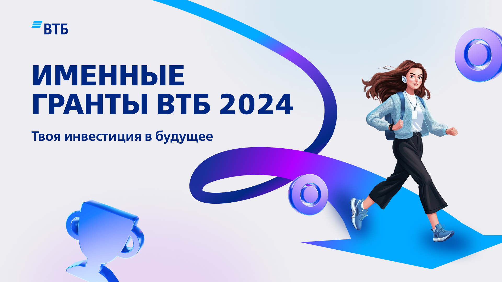
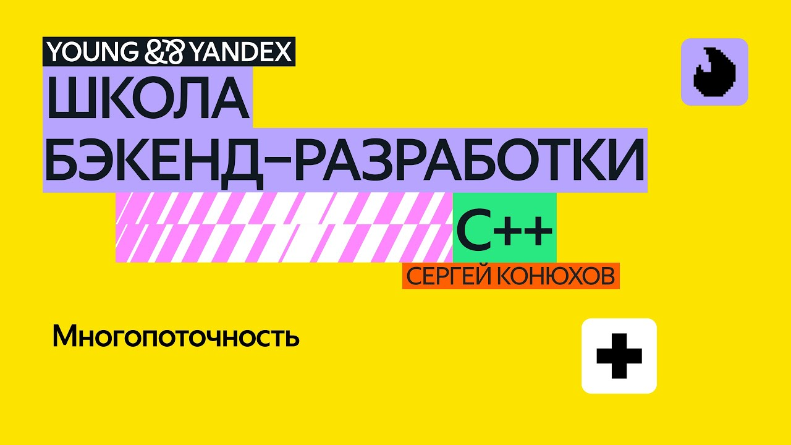

# Мои проекты в сфере HR-бренда

Здесь собраны ключевые проекты и исследования, которые я реализовала в области HR-брендинга.

## 🎯 Ключевые реализованные проекты

### Проект 1: ВТБ Именные гранты 2024

**Период:** Январь 2024 — Июнь 2024  
**Статус:** ✅ Успешно завершен  
**Роль:** Координатор образовательной программы

**Описание проекта:**
Масштабная образовательная программа для молодых специалистов, организованная при поддержке банка ВТБ. Проект направлен на выявление и развитие талантливой молодежи в сфере финансов и технологий.

#### 📊 Результаты проекта:

| Показатель | Значение | Превышение плана |
|------------|----------|------------------|
| Регистрации участников | **1,250+** заявок | +25% от целевого показателя |
| Проведено лекций | **14** образовательных модулей | +2 дополнительных модуля |
| Домашние задания | **12** практических работ | 100% выполнение программы |
| География | **45** городов России | В 2 раза шире планируемого |
| Отсев | Всего **18%** | На 7% ниже планового |

#### 🎓 Образовательная программа:

**Структура курса:**
- 📈 **Финансовый блок** (5 лекций) - основы инвестиций, риск-менеджмент
- 🚀 **Технологический блок** (4 лекции) - финтех, цифровая трансформация  
- 💼 **Карьерный блок** (3 лекции) - личный бренд, собеседования
- 🎯 **Практический блок** (2 лекции) - кейсы от экспертов ВТБ

**Эксперты программы:**
- Топ-менеджеры ВТБ
- Ведущие финтех-специалисты
- HR-директора финансового сектора
- Карьерные коучи

#### 🌟 Успехи участников:

- **15 выпускников** получили предложения о стажировке в ВТБ
- **8 проектов** были рекомендованы к внедрению в банке
- **95% участников** оценили программу на 8+ баллов из 10
- Сформировано **профессиональное сообщество** 450+ человек

**Используемые технологии:** `Zoom` `Telegram` `Google Forms` `Notion` `Miro` `HR-portal ВТБ`

---

### Проект 2: Школа Бэкенд Разработки (ШБР) - Яндекс 

**Период:** Июнь 2023 — Сентябрь 2024  
**Статус:** ✅ Успешно завершен  
**Роль:** Куратор образовательного направления

**Описание проекта:**
Комплексная программа развития навыков для молодых backend разработчиков.

#### 📈 Итоги программы:
 Показатель | Результат | Эффективность |
|------------|-----------|---------------|
| Выпускники | **325** успешных выпускников | 92% completion rate |
| Образовательные модули | **18** лекций и воркшопов | 100% программы |
| Практические кейсы | **24** разобранных кейса | Из 12 отраслей |
| Нетворкинг-сессии | **8** мероприятий | 450+ контактов |
| Выпускные проекты | **45** защищенных проектов | 15% к внедрению |

#### 💼 Результаты для участников:

- **45% участников** получили стажировку в течение 3 месяцев после окончания
- **89% выпускников** остались в сообществе ШБР

**Используемые платформы:** `Microsoft Teams` `Slack` `Miro` `Trello` `Google Workspace` `CRM система`

---